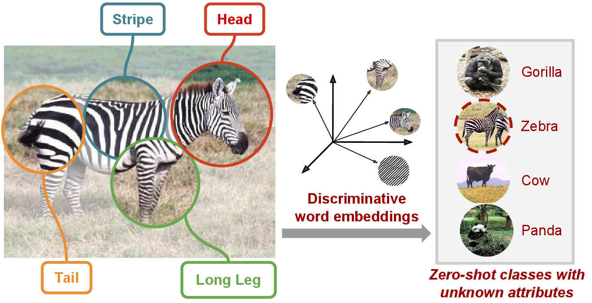

This repository contains a TensorFlow implementation of the [Attributes2Classname: A discriminative model for attribute-based unsupervised zero-shot learning](https://arxiv.org/pdf/1705.01734.pdf).

### License

attributes2classname is released under the MIT License (refer to the LICENSE file for details).

### Citing attributes2classname

If you find attributes2classname useful in your research, please consider citing:

    @InProceedings{Demirel_2017_ICCV,
        author = {Demirel, Berkan and Cinbis, Ramazan Gokberk and Ikizler-Cinbis, Nazli},
        title = {Attributes2Classname: A Discriminative Model for Attribute-Based Unsupervised Zero-Shot Learning},
        booktitle = {The IEEE International Conference on Computer Vision (ICCV)},
        month = {Oct},
        year = {2017}
    }
### Software Requirements
    scipy==0.19.0
    tflearn==0.3.1
    numpy==1.13.0
    easydict==1.6
    tensorflow==1.0.1
    matplotlib==1.5.1
    
### How to train and evaluate a model:
1. Modify the training script (i.e. `master.py`) to point to your data directory.
2. Run the training script (i.e. `master.py`) to learn best parameters for your features. The applyCrossValidation variable must be marked True (`applyCrossValidation=True`) in order to learn the parameters.
3. After learning the relevant parameters, run the training script with these parameters to train and evaluate the PBT or IBT model. The applyCrossValidation variable must be marked False (`applyCrossValidation=False`) in order to learn and evaluate the correct model.

### Pretrained models:
Pretrained models and related parameters are shared under `models/` directory. `NUM_HIDDEN` and `stopIter` parameters for these models are as follows:
* IBT-AwA: NUM_HIDDEN=100, stopIter=26000
* PBT-AwA: NUM_HIDDEN=400, stopIter=6000
* IBT-aPaY: NUM_HIDDEN=100, stopIter=15800
* PBT-aPaY: NUM_HIDDEN=100, stopIter=6000

